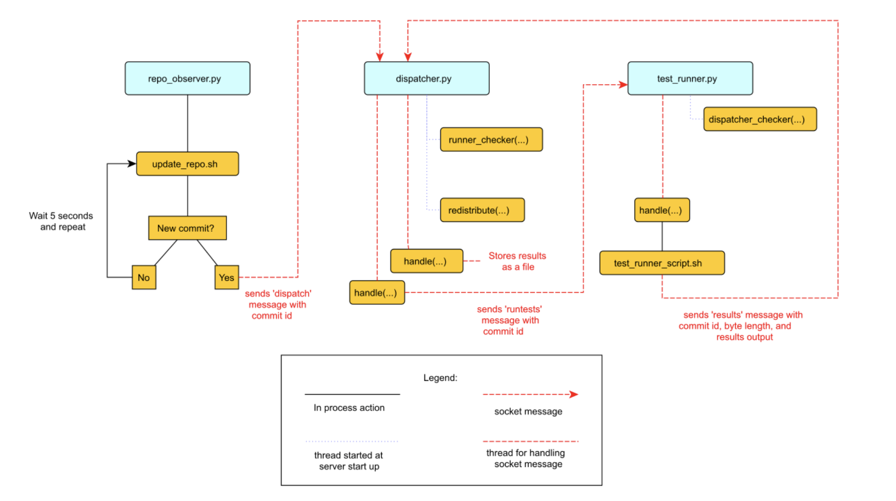

# Simple continuous Integration System

## Authors
- Julian Kozlowski (@Yashiru99 on GitHub)

## Description
The project is based on `https://aosabook.org/en/500L/a-continuous-integration-system.html`.
It will be simple CLI system, it will be based on 3 components: an observer, a test job dispatcher, and a test runner. They are 3 separate processes and will communicate to each other via websockets.
Whole flow can be described in diagram presented below:


## Features
- Running tests on the recent commit after 5 seconds period
- Gathering files of test results in the file system local to the dispatcher (Results of testing are stored down bash scripts folder in file called `TestResults.txt`)

## Plan
As the components are complementary to each other (via communicating) it's tough to make distinction into two separate parts, but if I were to I would do it like that:

1st part: Implementing observer and dispatcher
2nd part: Implementing test-runner and sample tests 

## Libraries used
serde, log, clap

## Potential todo's and refactors left:
- use tokio for async programming, right now as it is heavily inspired by the aosa book each process is actively waiting and checking periodically for new messages
- make erros more robust using `anyhow` and `thiserror` 

## How to run the certain binaries
```rust
cargo run --bin repo_observer 
cargo run --bin dispatcher
cargo run --bin test_runner
```
To check if it works you can make some change in test_repo (like adding some file), adding file to git and making a commit. You should see results of the test run in the `TestResults.txt` file within 5 seconds.


To run demostrative version you don't have to add extra arguments, hovewer it is possible if you want to test your own repo, in this case you run binaries like that:
```rust
cargo run --bin repo_observer --socket ... --repository_path ...
cargo run --bin dispatcher --socket ...
cargo run --bin test_runner --dispatcher_socket ... --test_runner_socket ...
--repository_path ...
```
If you want to print debug messages, procede cargo command with `RUST_LOG=debug`.